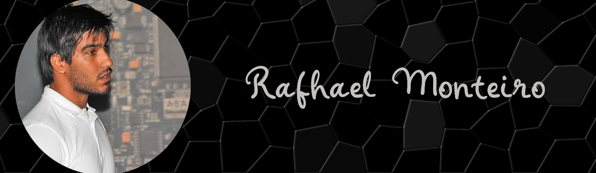

 Olá, eu Rafhael Monteiro sou um estudante de Engenharia Eletrotécnica e de Computadores com sólidos conhecimento e experiência adquirida em cursos, projetos e atuação profissional. 

 Desde quando iniciei minha primeira formação na área de eletrônica, venho me aperfeiçoando e ampliando meus conhecimentos, focando para área de programação,sistemas embarcados, sistema operacional em tempo real (RTOS) e Internet das coisas (IoT), atuamente estou gerenciando <a href = "https://www.instagram.com/upinc.makers/">@UPinC.Makers</a>

  Visite a pagina no instagram:
<a href = "https://www.instagram.com/upinc.makers/">@UPinC.Makers</a>

Visite o GitHub:
<a href = "https://github.com/UpinCMakers">UPinC.Makers</a>

  
<h3>:busts_in_silhouette: Contato</h3>

<ul>
  <li>Email: rafhael.x@outlook.com</li>
  <li>Linkedin: <a href = "https://www.linkedin.com/in/rafhaelmonteirorobotica/">Rafhael Monteiro</a></li>
  
</ul>
